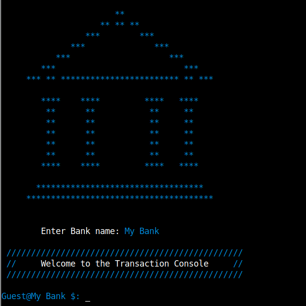
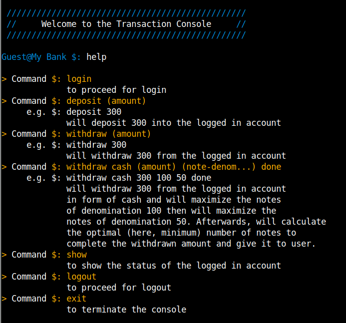
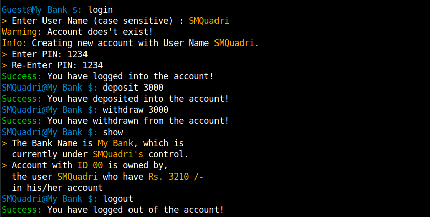
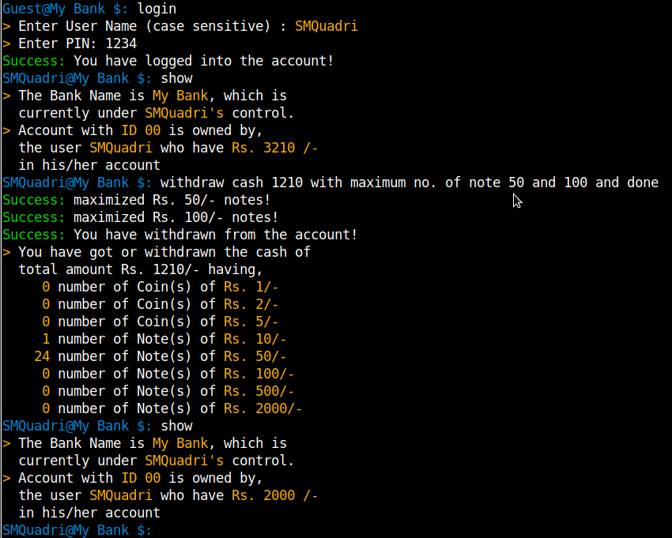
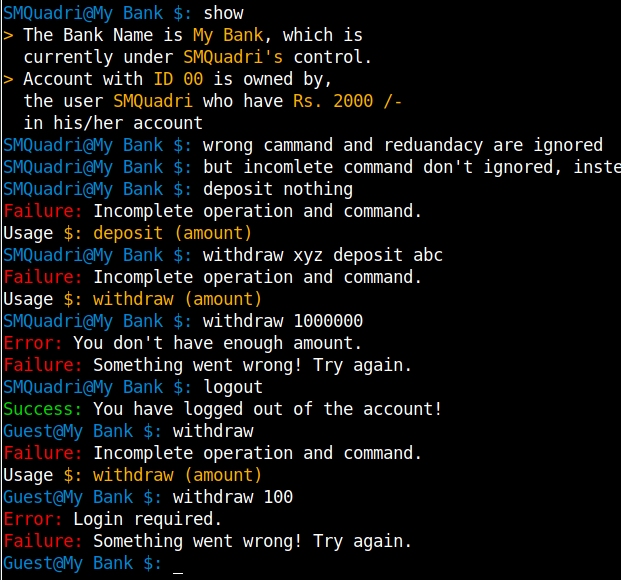

# Transaction Console

Transaction Console - is a console program build using procedural C programming - and a part of it using a Greedy approach to solving problems - as a project work conducted by Deogiri Institute of Engineering and Management Studies for 'Design and Analysis of Algorithm' subject.

                       **                         
                    ** ** **                      
                 ***        ***                   
              ***              ***                
           ***                    ***             
        ***                          ***          
     *** ** ************************ ** ***       
                                                  
        ****    ****         ****   ****          
         **      **           **     **           
         **      **           **     **           
         **      **           **     **           
         **      **           **     **           
         **      **           **     **        
        ****    ****         ****   ****          
                                                  
       **********************************         
     **************************************       

## 1. Getting Started

You can find the [source code](https://github.com/s-m-quadri/DIEMS-Lab-Work/tree/main/Algorithms_(Design_and_Analysis)/Transaction_Console) with documentation and details, the [download link](https://minhaskamal.github.io/DownGit/#/home?url=https://github.com/s-m-quadri/DIEMS-Lab-Work/tree/main/Algorithms_(Design_and_Analysis)/Transaction_Console), the [presentation](https://docs.google.com/presentation/d/1dHO6gfuDkVlOmNpsqJTg1qTbhL0yxjn64XYxIdvr-NA/edit?usp=sharing) and [problem statement](https://docs.google.com/document/d/1rmJcuww_F4fHgcUUa9SzjrW66HLRldLCSCLAjv7JJ9k/edit?usp=sharing) from which you can read and learn as well as download the libraries and as project whole. You can clone the [root repository](https://github.com/s-m-quadri/DIEMS-Lab-Work) as,

    git clone https://github.com/s-m-quadri/DIEMS-Lab-Work.git

## 2. Usage

After cloning the project or source file navigate to,
[Algorithms_(Design_and_Analysis)](https://github.com/s-m-quadri/DIEMS-Lab-Work/tree/main/Algorithms_(Design_and_Analysis)/Transaction_Console) > [Transaction_Console](https://github.com/s-m-quadri/DIEMS-Lab-Work/tree/main/Algorithms_(Design_and_Analysis)/Transaction_Console) > ...
making your current working directory.

All you need to do is run the appropriate executable file.

    Just Double click for windows users

For linux users, simply run

    ./Linux64_Transaction_Console.out 

Also you can compile the code (if needed) in the **src** folder.

    gcc cs50.c bank.c token.c main.c -o Linux64_Transaction_Console.out
can do (optionally) memory check using

    valgrind ./Linux64_Transaction_Console.out 

or (optionally) time check using

    time ./Linux64_Transaction_Console.out 

## 3. Documentation

    Command $: help

... to get the help

    Command $: login

... to proceed for login

    Command $: deposit (amount)
    e.g.    $: deposit 300

... will deposit 300 into the logged in account

    Command $: withdraw (amount)
    e.g.    $: withdraw 300

... will withdraw 300 from the logged in account

    Command $: withdraw cash (amount) (note-denom...) done
    e.g.    $: withdraw cash 300 100 50 done

... will withdraw 300 from the logged-in account in form of cash and will maximize the notes of denomination 100 then will maximize the notes of denomination 50. Afterwards, will calculate the optimal (here, minimum) number of notes to complete the withdrawn amount and give it to user.

    Command $: show

... to show the status of the logged in account

    Command $: logout

... to proceed for logout

    Command $: exit

... to terminate the console

## Thanks for visiting
